# Rozchmurz swoje pliki!
## Optymalizacja obrazów w AWS

Paweł Lorenc
---
fonts:
  sans: 'Robot'
  serif: 'Robot Slab'
  mono: 'Fira Code'
---

# Czym się różnią?

<div grid="~ cols-2 gap-1" m="t-1">
  <div>
   
  </div>
  <div>
   
  </div>
</div>

---

# Czym się różnią?

<div grid="~ cols-2 gap-1" m="t-1">
  <div>
   
   png - 1.3 MB
  </div>
  <div>
   
   webP - 79 kB
  </div>
</div>

---
layout: two-cols
src: pages/test.md
---

---

# Co widzieliście?

---
layout: two-cols
src: pages/test.md
---

---
layout: image-right
image: images/brainstorming.jpeg
---

---
layout: image-right
image: images/brainstorming.jpeg
class: in-the-center
---

 

---
layout: image-right
image: images/jak.jpeg
---

---
layout: image-right
image: images/jak.jpeg
---

# Jak?

---
layout: two-cols
---

<div>
- wysłać plik na serwer

```ts
fs.writeFileSync('original.png', buffer);
```
</div>

<div v-click>
- przetworzyć plik na serwerze

```ts
const buffer = await sharp(buffer)
.resize(300, 300)
.toBuffer();
```
</div>

<div v-click>
- zapisać przetworzony plik

```ts
fs.writeFileSync('transformed.png', buffer);
```
</div>

<div v-click>
- udostępnić link do pliku

```ts
https://example.com/images/transformed.png
```
</div>

---
layout: two-cols
---

- wysłać plik na serwer

```ts
fs.writeFileSync('original.png', buffer);
```

- przetworzyć plik na serwerze

```ts
const buffer = await sharp(buffer)
.resize(300, 300)
.toBuffer();
```

- zapisać przetworzony plik

```ts
fs.writeFileSync('transformed.png', buffer);
```

- udostępnić link do pliku

```ts
https://example.com/images/transformed.png
```

::right::
<div style="margin: 0 auto; text-align: center;">
  Przechowywanie - <span style="font-weight: bold;">Amazon S3</span>
  
  Przetwarzanie - <span style="font-weight: bold;">AWS Lambda</span>
  
  Serwowanie - <span style="font-weight: bold;">Amazon CloudFront</span>
  
</div>

---

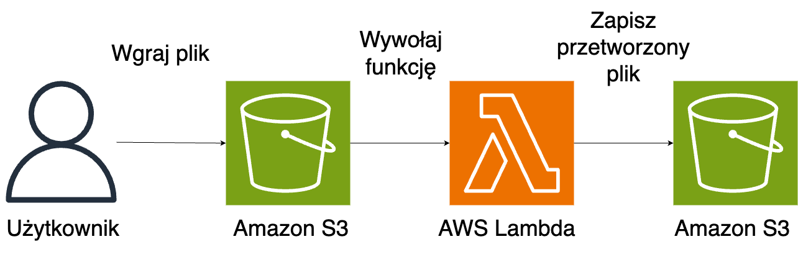

---


<div style="display: flex; margin: 30px auto 0; width: 100%; text-align: center;">
  <div style="display: flex; flex-direction: column; align-items: bottom; justify-content: bottom;">
    
    <div>2000 x 2000px</div>
  </div>
  <div style="display: flex; flex-direction: column; align-self: bottom; justify-content: flex-end;">
    
    <div>1000 x 1000px</div>
  </div>
</div>

---
layout: image-right
image: images/size-image.png
---

# Na co wpływa rozmiar?

- czas ładowania strony
- więcej danych do przetransferowania
- zwiększone koszty
- SEO


---
layout: image-right
image: images/cloudfront-map.png
---

## Cloud Delivery Network 
(CDN)

<div v-click>
- Link S3

```ts
https://rozchmurz.s3.eu-central-1.amazonaws.com/cat.png
```

- Link CloudFront

```ts
https://d3t8w3h30go7tk.cloudfront.net/cat.png
```

- Własny link

```ts
https://cdn.pawellorenc.com/cat.png
```
</div>

<div style="text-align: center">
  
  <span style="font-weight: bold;">Amazon CloudFront</span>
</div>

---
layout: image-right
image: images/spiderman-venom3.jpeg
---

# Co na pewno wydarzy się w projekcie?

<div style="text-decoration: line-through" v-click>przekroczony deadline</div>
<div style="text-decoration: line-through" v-click>brak błędów</div>
<div style="text-decoration: line-through" v-click>nieskończony budżet</div>


<div v-click style="margin: 30px auto 0; font-size: 45px;">ZMIANA</div>

---
layout: image-right
image: images/slasknet_logo3.png
---

# Śląsknet
slasknet.com - istnieje od 2001 roku

<div v-click>
Galerie:
<ul>
  <li>ograniczone liczba zdjęć</li>
  <li>ograniczona wielkość zdjęć</li>
</ul>
</div>

<div v-click style="margin-top: 30px;">
Oryginały:
<ul>
  <li>na dyskach zewnętrznych</li>
</ul>
</div>


---
layout: two-cols
image: images/slasknet_logo3.png
---

# Śląsknet
slasknet.com

<div>Rekomendowane szerokości zdjęć w galeriach:</div>
<ul>
  <li>do 2014 roku - 800px</li>
  <li v-click>do 2018 roku - 1400px</li>
  <li v-click>do 2022 - 1920px</li>
  <li v-click>obecnie - 3000px</li>
</ul>

::right::
<div style="text-align:center">
  
  Polar Wrocław - Śląsk Wrocław (17.10.2004)

  
  Lechia Gdańsk - Śląsk Wrocław (04.09.2005)
</div>


---
layout: two-cols
---


::right::

<ul>
  <li v-click>Zdjęcie na stronie: 740 x 360 px</li>
  <li v-click>Różne standardy dla FB, TT, YT</li>
  <li v-click>Rekomendowana proporcja: 16:9</li>
  <li v-click>Powinno być: 740 x 416 px</li>
</ul>


---

# Dynamiczne przetwarzanie obrazów
https://github.com/aws-samples/image-optimization

---
clicks: 3
---

# Dynamiczne przetwarzanie obrazów

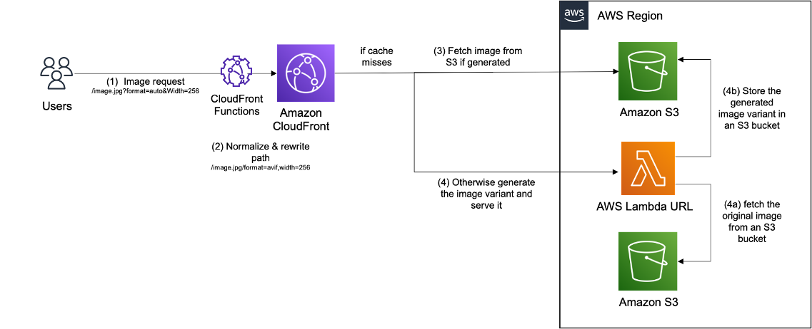

```ts {all|1|2|all}
/image.jpg?format=auto&Width=256
/image.jpg/format=avif,width=256
```

<arrow v-click="[1, 2]" x1="200" y1="400" x2="200" y2="200" color="#564" width="3" arrowSize="1" />
<arrow v-click="[2, 3]" x1="200" y1="400" x2="300" y2="280" color="#564" width="3" arrowSize="1" />

---
layout: two-cols
clicks: 9
---

# Formaty plików

<ul>
  <li v-click="1">JPEG</li>
  <li v-click="1">PNG <span v-click="2">(przezroczystość)</span></li>
  <li v-click="1">GIF <span v-click="2">(animacja)</span></li>
  <li v-click="3">SVG <span>(wektory)</span></li>
  <li v-click="4">WEBP</li>
  <li v-click="5">AVIF <span v-click="6">(nie wspierany przez Edge)</span></li>
  <li v-click="7">JPEG XL (JXL) <span v-click="8">(nie wspierany przez Chrome)</span></li>
  <li v-click="9">WEBP2</li>
</ul>

::right::

<div v-click="5">

```ts
case 'format': 
  var SUPPORTED_FORMATS = ['auto', 'jpeg', 'webp', 'avif', 'png', 'svg', 'gif'];
  if (request.querystring[operation]['value'] && SUPPORTED_FORMATS.includes(request.querystring[operation]['value'].toLowerCase())) {
      var format = request.querystring[operation]['value'].toLowerCase();
      if (format === 'auto') {
          format = 'jpeg';
          if (request.headers['accept']) {
              if (request.headers['accept'].value.includes("avif")) {
                  format = 'avif';
              } else if (request.headers['accept'].value.includes("webp")) {
                  format = 'webp';
              } 
          }
      }
      normalizedOperations['format'] = format;
  }
break;
```
</div>
---

# Ile potrzeba miejsca i czasu?

<div v-click>
  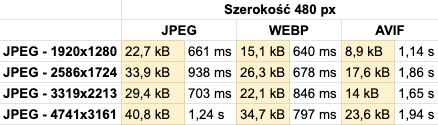

  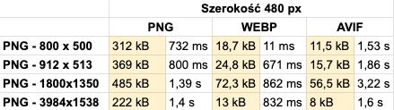
</div>

---

# Ile potrzeba miejsca i czasu?

<div>
  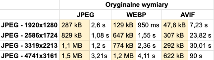

  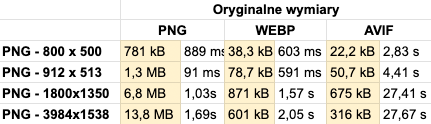
</div>

---

# Ile potrzeba miejsca i czasu?

<div>
  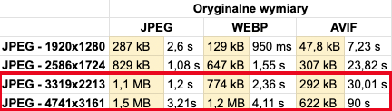

  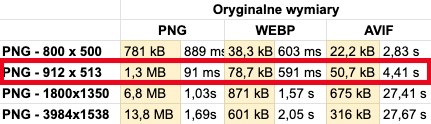
</div>

---

# Jak żyć?

---
layout: image
image: images/glapinski.jpeg
---

---
layout: image
image: images/kiszonki.webp
---

---

<div v-click style="text-align: center; font-size: 50px; margin: 0 auto;">
  <div>Dostosuj rozwiązania pod siebie</div>
</div>

---

# next/image

<div v-click>

```ts
import Image from 'next/image'
 
export default function Page() {
  return (
    <div className="grid-element">
      <Image
        fill
        src="https://cdn.pawellorenc.com/wks_exposito_radosc.jpeg"
        sizes="(max-width: 768px) 100vw, (max-width: 1200px) 50vw, 33vw"
      />
    </div>
  )
}
```

</div>

---

# Upload plików

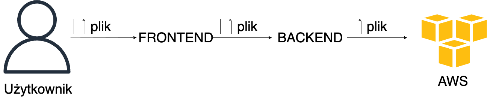

---

# Upload plików

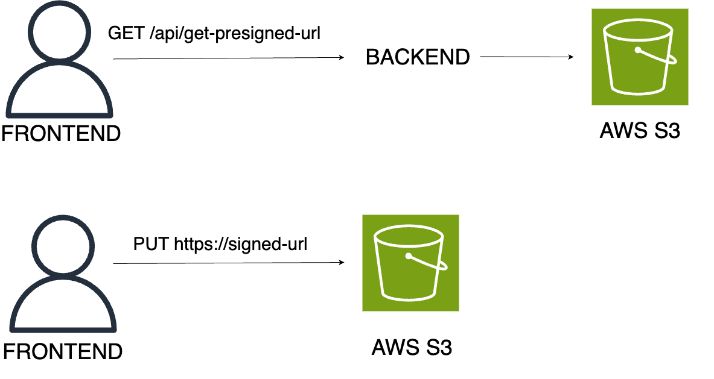


---
layout: image-right
image: images/money.jpeg

---

# Koszty

Ile to wszystko będzie kosztować?

---

# AWS Free Tier

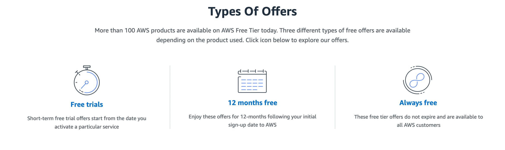

---

# Koszty - S3

- przechowywanie danych: $0,0245 za każdy GB dla pierwszych 50 TB miesięcznie
- upload plików:  darmowe
- transfer wychodzący: $0,09 za każdy GB dla pierwszych 10 TB (pierwsze 100 GB mc - darmowe)
- pobieranie plików: $0.00043 za każde 1000 zapytań
- wgrywanie plików: $0.00054 za każde 1000 zapytań

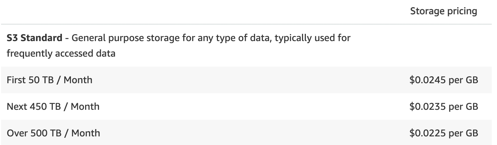

---

# Koszty - CloudFront

- transfer wychodzący: $0,085 za każdy GB dla pierwszych 10 TB (pierwszy 1 TB mc - darmowe)
- zapytania: $0,0075 za każde 10 000
- CloudFront Functions: $0,1 dla miliona wywołań

<div style="text-align: center; margin-top: 20px;">
  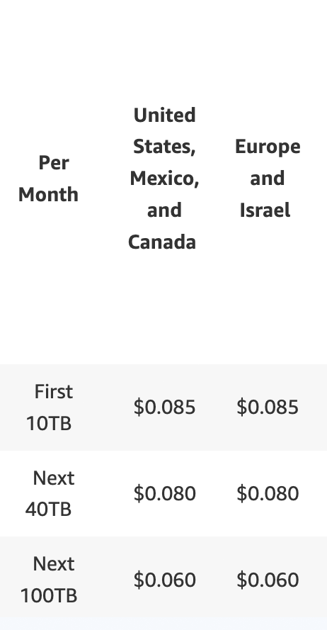
  
</div>

---

# Koszty - Lambda

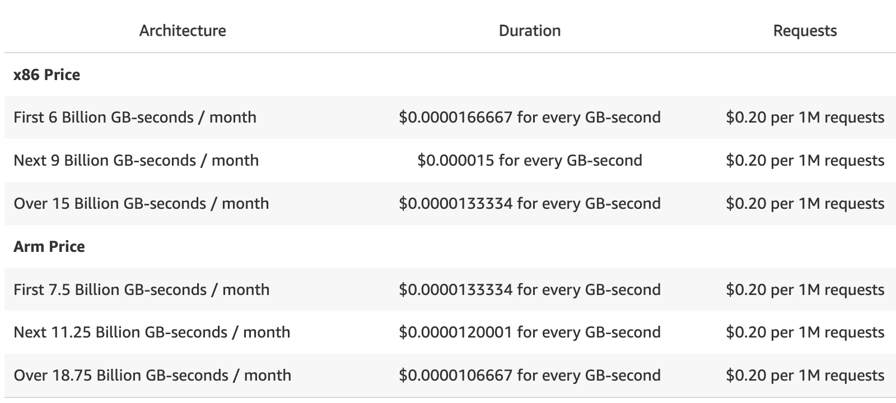

---

# Przykładowe koszty

<div v-click="1" style="font-size: 14px">
Założenia:
  <ul>
    <li>100 tysięcy oryginalnych zdjęć o średniej wielkości 400 kB</li>
    <li>tworzone 24 warianty każdego zdjęcia o średniej wielkości 22 kB</li>
    <li>miesięcznie przetwarzane 20% zdjęć z biblioteki</li>
    <li>milion zapytań miesięcznie z trafnością w pamięć podręczną na poziomie 95%</li>
    <li>dostępna pamięć dla lambdy to 1500 MB ze średnią czasem wykonania 100 ms</li>
  </ul>
</div>
<div v-click="2" style="font-size: 14px; margin-top: 16px;">
Koszty:
  <ul>
    <li>S3 - przechowywanie danych: (100k x 400kb + 100k x 24 x 22kb)/1GB * 0,023 = <b>$2,03</b>/mc</li>
    <li>Lambda - przetwarzanie zdjęć: 100k x 20% x 24 x (100/1000 x 1500/1024 x 0,0000166667 + 0,2/1M) = <b>$1,27</b>/mc</li>
    <li>S3 - zgranie i wgranie pliku: 100k x 20% x 24 x (0,005 + 0,0004)/1000 = <b>$2.59</b>/mc</li>
    <li>CF - transfer: 1M x 22/1024/1024×0,085=<b>$1,78</b>/mc</li>
    <li>CF - zapytania: 1M * 0,0075/10000=<b>$0.75</b>/mc</li>
    <li>CF Functions - <b>$0,1</b></li>
  </ul>
</div>

<div v-click="3" style="margin-top: 16px;">W sumie: $8,52 (realnie: <b>$4,62</b>)</div>

---

# Przykładowe koszty

<div style="font-size: 14px">
Założenia:
  <ul>
    <li>100 tysięcy oryginalnych zdjęć o średniej wielkości 400 kB</li>
    <li>tworzone 24 warianty każdego zdjęcia o średniej wielkości 22 kB</li>
    <li>miesięcznie przetwarzane 20% zdjęć z biblioteki</li>
    <li>milion zapytań miesięcznie z trafnością w pamięć podręczną na poziomie 95%</li>
    <li>dostępna pamięć dla lambdy to 1500 MB ze średnią czasem wykonania 100 ms</li>
  </ul>
</div>
<div style="font-size: 14px; margin-top: 16px;">
Koszty:
  <ul>
    <li>S3 - przechowywanie danych: (100k x 400kb + 100k x 24 x 22kb)/1GB * 0,023 = <b>$2,03</b>/mc</li>
    <li style="text-decoration: line-through">Lambda - przetwarzanie zdjęć: 100k x 20% x 24 x (100/1000 x 1500/1024 x 0,0000166667 + 0,2/1M) = <b>$1,27</b>/mc</li>
    <li>S3 - zgranie i wgranie pliku: 100k x 20% x 24 x (0,005 + 0,0004)/1000 = <b>$2.59</b>/mc</li>
    <li style="text-decoration: line-through">CF - transfer: 1M x 22/1024/1024×0,085=<b>$1,78</b>/mc</li>
    <li style="text-decoration: line-through">CF - zapytania: 1M * 0,0075/10000=<b>$0.75</b>/mc</li>
    <li style="text-decoration: line-through">CF Functions - <b>$0,1</b></li>
  </ul>
</div>

<div style="margin-top: 16px;">W sumie: $8,52 (realnie: <b>$4,62</b>)</div>

----

# Rozchmurz swoje pliki
## optymalizacja obrazów w AWS
